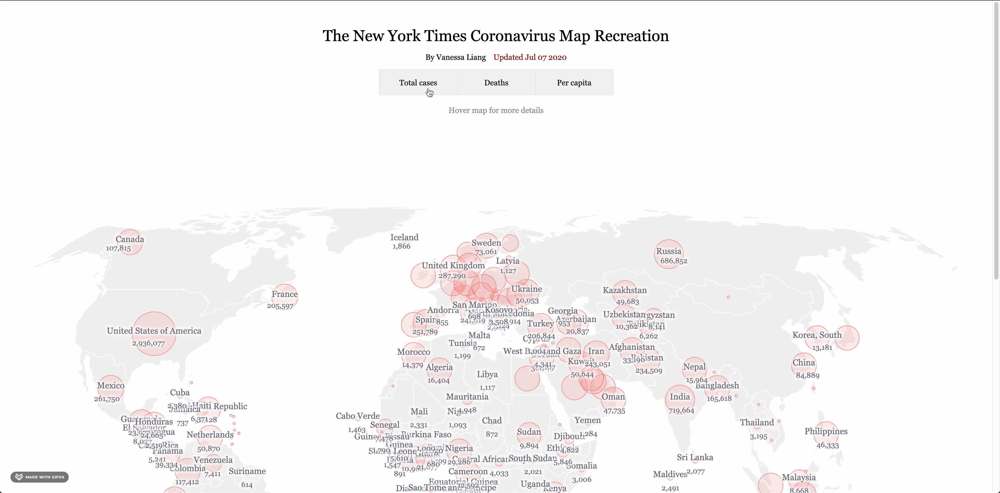

# The New York Times Coronavirus Map Recreation with React

The recreation can be found [here](https://vanessaaleung.github.io/corona-map-react/). This project is inspired by the [New York Times' Coronavirus Map](https://www.nytimes.com/interactive/2020/world/coronavirus-maps.html).

## Data
The data is realtime fetched from [Johns Hopkins University](https://github.com/CSSEGISandData/COVID-19)

## Techstack
1. D3.js
2. React

## In-development
***This project hasn't been updated since March 2020.***

1. Resize the circle as cases number has increased dramatically since March.
2. Add tooltips for circles
