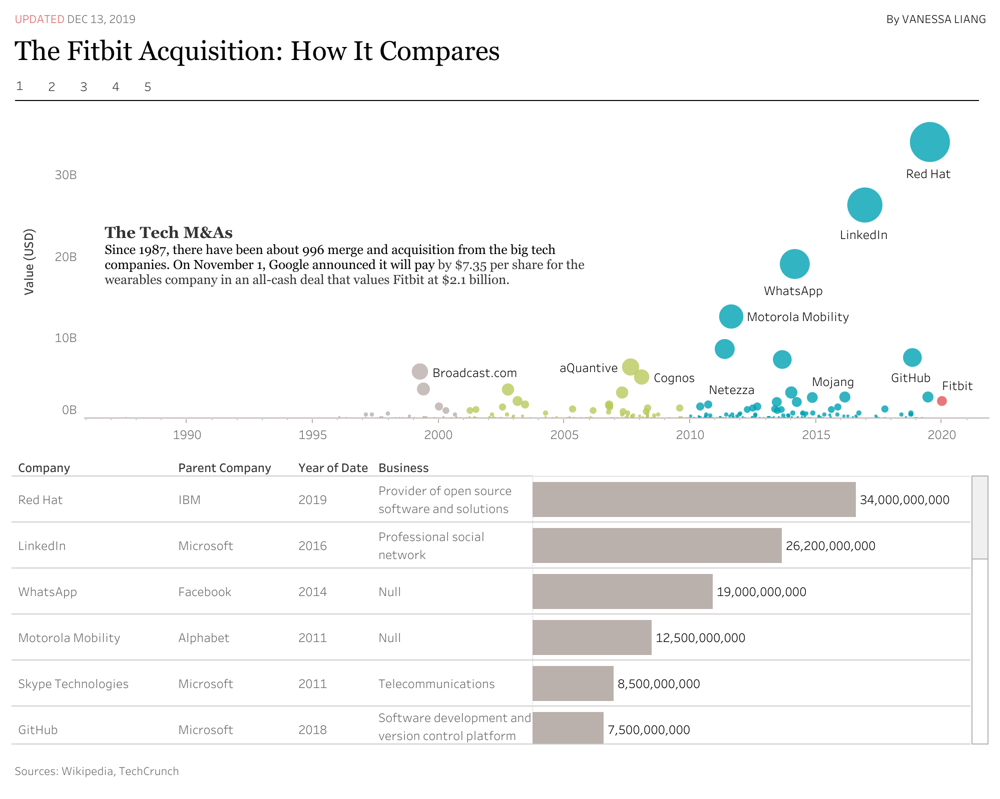

# Visualization of Big Tech M&amp;As
This project aims to explore the trend of big tech companies' M&A for the last two decades, and try to provide insights for both the startups and the investors.
* Check out  this visualization made with D3.js: [here](https://vanessaaleung.github.io/fitbit_acquisition/)
* Check out  this visualization made with Tableau: [here](https://public.tableau.com/profile/vanessaaleung/#!/vizhome/TechMA_15762658085230/Dashboard1)
* Check out my short journalism: [here](https://vanessaaleung.github.io/TechMA/)

## Data
The data used in this project was collected from Wikipedia and Crunchbase.
- [List of mergers and acquisitions by Alphabet](https://en.wikipedia.org/wiki/List_of_mergers_and_acquisitions_by_Alphabet)
- [List of mergers and acquisitions by Facebook](https://en.wikipedia.org/wiki/List_of_mergers_and_acquisitions_by_Facebook)
- [List of mergers and acquisitions by IBM](https://en.wikipedia.org/wiki/List_of_mergers_and_acquisitions_by_IBM)
- [List of mergers and acquisitions by Microsoft](https://en.wikipedia.org/wiki/List_of_mergers_and_acquisitions_by_Microsoft)
- [Google is acquiring Fitbit for $2.1 billion](https://techcrunch.com/2019/11/01/google-is-acquiring-fitbit/)

## Techstack
1. [D3.js](https://d3js.org/): A JavaScript library for manipulating documents based on data
2. [Tableau](https://www.tableau.com/): A powerful and fastest growing data visualization tool

## In-development Features
1. Add tooltips for D3 graphs
2. Add the search feature for the D3 table

## Design Process
### Goals of the Project
#### Target audience
The management of tech companies, tech startups, and the general public who are concerned with the Fitbit acquisition and the historical acquisition in the tech industry.

#### Story to tell
On November 1 this year, Google confirmed that it will pay $7.35 per share for the wearables company Fitbit in an all-cash deal that values Fitbit at $2.1 billion. The project is aimed to visualize and compare the Fitbit acquisition’s position with all the historical  Merge and Acquisitions(M&A) in the tech industry. Besides, it can give the audience a better understanding of the M&A in the tech industry from the perspective of acquisition value, industry distribution, parent company, and the overall yearly trend. The data tracks the M&A from seven big tech companies: Alphabet, Apple, Facebook,  Microsoft, IBM, Twitter, and Yahoo!, from 1987 to 2020. 

#### Key takeaways for the audience
For the management, the project can support developing their M&A strategies. For the tech startups who are looking for funding or want to be bought by big companies, the project can help them understand the M&A industry focus and willingness(trend) of the big tech companies. For the general public, the story could help them develop a better understanding of the issue and even help with stock purchase decisions.

### Analysis from Data
I am surprised that Apple, which is always labeled as the most innovative company, is not active in acquiring new companies. The reason may be Apple focus on developing new products on their own or has a high threshold of acquiring new companies. It’s also interesting that the acquisition of Broadcast.com by Yahoo in 1999 is still ranked as the ninth largest acquisition after almost 20 years.  Insights like industry preferences and evolution, activeness in acquisitions can all be used to analyze different companies’ M&A strategies and even possibly help identify the trend of focus in tech development. 

### Design Choices
#### Data Source
I first came up with the idea of this topic when I found the Kaggle Company Acquisitions Data dataset. However, I found the dataset was outdated so I scraped the most recent data from Wikipedia as my data source. 

#### Data Cleaning
The most time-consuming part of this project is to clean and merge the data from different companies’ pages. The acquisition value fields from Wikipedia were totally messed up with combinations of strings and numbers. And some values were given as a range. Thus, case by case research is needed to determine if the median of the range should be taken as the acquisition value. To analyze the business distribution of companies acquired by Alphabet, I had to research and manually input the value.

#### Color & Font
Fitbit’s logo color is Tiffany Blue. I chose light grey, light green, and Tiffany Blue as the color scheme of my dashboards. Tiffany Blue is used to emphasize the main object of the visualization and light grey is used for other objects to increase contrast and avoid frustration. To illustrate the story in a journalism way,  I chose Georgia for my annotations. Tableau Book is used for the labels and axes since it’s more clear and intuitive on charts.

#### Charts
To emphasize the position of Fitbit acquisition’s position with all the historical M&A in the tech industry, I used scatter plots to visualize the relationship between year and acquisition value and used acquisition value to size the dots. I also found the combination of tables and bar charts helpful in clearly displaying information regarding companies with top acquired values.  To deal with the skewness towards large acquisition values, I used the logarithmic scale in one of my visualizations.

#### Dashboards
Instead of squeezing all sheets into one dashboard, I used multiple dashboards to illustrate the story from different perspectives. I added buttons to easily switch between dashboards. To better connect the visualization to my written story, I added short annotations on each dashboard to briefly introduce the objective and data points that are insightful.

