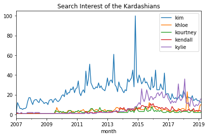
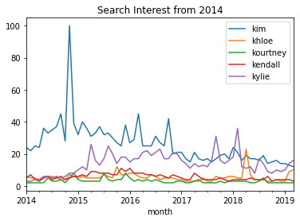
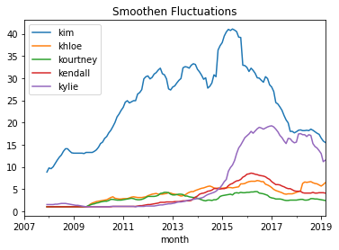
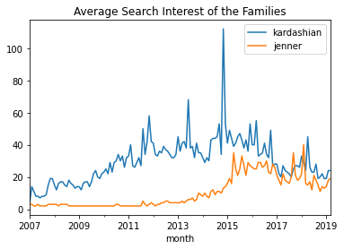

# Up and Down With the Kardashians

While I'm not a fan nor a hater of the Kardashians and Jenners, the polarizing family intrigues me. Why? Their marketing prowess. Say what you will about them and what they stand for, they are great at the hype game. Everything they touch turns to content.

The sisters in particular over the past decade have been especially productive in this regard. Let's get some facts straight. I consider the "sisters" to be the following daughters of Kris Jenner. Three from her first marriage to lawyer <a href="https://en.wikipedia.org/wiki/Robert_Kardashian">Robert Kardashian</a>:

<ul>
<li><a href="https://en.wikipedia.org/wiki/Kourtney_Kardashian">Kourtney Kardashian</a> (daughter of Robert Kardashian, born in 1979)</li>
<li><a href="https://en.wikipedia.org/wiki/Kim_Kardashian">Kim Kardashian</a> (daughter of Robert Kardashian, born in 1980)</li>
<li><a href="https://en.wikipedia.org/wiki/Khlo%C3%A9_Kardashian">Khloé Kardashian</a> (daughter of Robert Kardashian, born in 1984)</li>
</ul>

And two from her second marriage to Olympic gold medal-winning decathlete, <a href="https://en.wikipedia.org/wiki/Caitlyn_Jenner">Caitlyn Jenner</a> (formerly Bruce):

<ul>
<li><a href="https://en.wikipedia.org/wiki/Kendall_Jenner">Kendall Jenner</a> (daughter of Caitlyn Jenner, born in 1995)</li>
<li><a href="https://en.wikipedia.org/wiki/Kylie_Jenner">Kylie Jenner</a> (daughter of Caitlyn Jenner, born in 1997)</li>
</ul>

This family tree can be confusing, but we aren't here to explain it. We're here to explore the data underneath the hype, and we'll do it using search interest data from Google Trends. We'll recreate the Google Trends plot to visualize their ups and downs over time, then make a few custom plots of our own. And we'll answer the big question: <strong>is Kim even the most famous sister anymore?</strong>

First, let's load and inspect our Google Trends data, which was downloaded in CSV form. The <a href="https://trends.google.com/trends/explore?date=2007-01-01%202019-03-21&q=%2Fm%2F0261x8t,%2Fm%2F043p2f2,%2Fm%2F043ttm7,%2Fm%2F05_5_yx,%2Fm%2F05_5_yh">query</a> parameters: each of the sisters, worldwide search data, 2007 to present day. (2007 was the year Kim became "active" according to Wikipedia.)

## Analysis

Kim's <a href="https://en.wikipedia.org/wiki/Kim_Kardashian#2007%E2%80%932009:_Breakthrough_with_reality_television">sharp rise in 2007</a>, with the beginning of <a href="https://en.wikipedia.org/wiki/Keeping_Up_with_the_Kardashians"><em>Keeping Up with the Kardashians</em></a>, among other things. There was no significant search interest for the other four sisters until mid-2009 when Kourtney and Khloé launched the reality television series, <a href="https://en.wikipedia.org/wiki/Kourtney_and_Kim_Take_Miami"><em>Kourtney and Khloé Take Miami</em></a>. Then there was Kim's rise from famous to <a href="https://trends.google.com/trends/explore?date=all&geo=US&q=%2Fm%2F0261x8t,%2Fm%2F0d05l6">literally more famous than God</a> in 2011. This Cosmopolitan <a href="https://www.cosmopolitan.com/uk/entertainment/a12464842/who-is-kim-kardashian/">article</a> covers the timeline that includes the launch of music videos, fragrances,  iPhone and Android games, another television series, joining Instagram, and more. Then there was Kim's ridiculous spike in December 2014: posing naked on the cover of Paper Magazine in a bid to break the internet will do that for you.

It looks like my suspicion may be true: Kim is not always the most searched Kardashian or Jenner sister. Since late-2016, at various months, Kylie overtakes Kim. Two big spikes where she smashed Kim's search interest: in September 2017 when it was reported that Kylie was expecting her first child with rapper Travis Scott and in February 2018 when she gave birth to her daughter, Stormi Webster. The continued success of Kylie Cosmetics has kept her in the news, not to mention making her the "The Youngest Self-Made Billionaire Ever" according to Forbes.

These fluctuations are descriptive but do not really help us answer our question: is Kim even the most famous sister anymore? We can use rolling means to smooth out short-term fluctuations in time series data and highlight long-term trends. Let's make the window twelve months a.k.a. one year.

Whoa, okay! So by this metric, Kim is still the most famous sister despite Kylie being close and nearly taking her crown. Honestly, the biggest takeaway from this whole exercise might be Kendall not showing up that much. It makes sense, though, despite her <a href="http://time.com/money/5033357/kendall-jenner-makes-more-than-gisele-bundchen/">wildly successful modeling career</a>. Some have called her "<a href="https://www.nickiswift.com/5681/kendall-jenner-normal-one-family/">the only normal one in her family</a>" as she tends to shy away from the more dramatic and controversial parts of the media limelight that generate oh so many clicks.

In it, we will plot (pun!) the Kardashian sisters against the Jenner sisters to see which family line is more popular now. We will use average search interest to make things fair, i.e., total search interest divided by the number of sisters in the family line.

<strong>The answer?</strong> Since 2015, it has been a toss-up. And in the future? With this family and their penchant for big events, who knows?

### Who's more famous? The Kardashians or the Jenners?

Since 2015, it has been a toss-up. And in the future? With this family and their penchant for big events, who knows?

