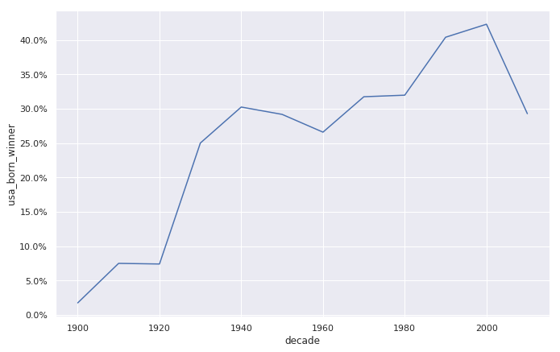
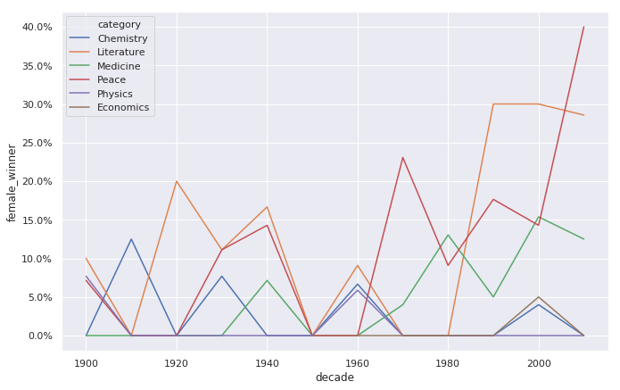
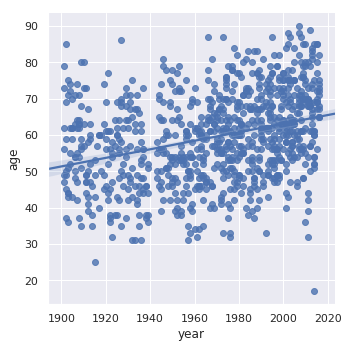
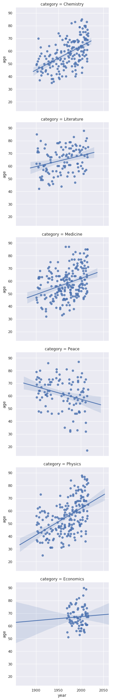

# A Visual History of Nobel Prize Winners

## Objective
The Nobel Prize is perhaps the world's most well known scientific award. Except for the honor, prestige and substantial prize money the recipient also gets a gold medal showing Alfred Nobel (1833 - 1896) who established the prize. Every year it's given to scientists and scholars in the categories chemistry, literature, physics, physiology or medicine, economics, and peace. The first Nobel Prize was handed out in 1901, and at that time the Prize was very Eurocentric and male-focused, but nowadays it's not biased in any way whatsoever. Surely. Right?

Well, we're going to find out! The Nobel Foundation has made a dataset available of all prize winners from the start of the prize, in 1901, to 2016. Let's load it in and take a look.

## Analysis
### Who gets the Nobel Prize?
#### Gender
|Male|836|
|---|---|
|Female|49|

#### Country
|United States of America    |259|
|---|---|
|United Kingdom               |85|
|Germany                      |61|
|France                       |51|
|Sweden                       |29|
|Japan                        |24|
|Netherlands                  |18|
|Canada                       |18|
|Russia                       |17|
|Italy                        |17|

Not so surprising perhaps: the most common Nobel laureate between 1901 and 2016 was a man born in the United States of America. But in 1901 all the winners were European. 

### USA dominance
When did the USA start to dominate the Nobel Prize charts? 

The USA became the dominating winner of the Nobel Prize first in the 1930s and had kept the leading position ever since.

### Female Winners

Overall the imbalance is pretty large with physics, economics, and chemistry having the largest imbalance. 
Medicine has a somewhat positive trend, and since the 1990s the literature prize is also now more balanced. 
The big outlier is the peace prize during the 2010s, but keep in mind that this just covers the years 2010 to 2016.

### Repeat laureates
The list of repeat winners contains some illustrious names!
We again meet Marie Curie, who got the prize in physics for discovering radiation and in chemistry for isolating radium and polonium. 
John Bardeen got it twice in physics for transistors and superconductivity, Frederick Sanger got it twice in chemistry, and Linus Carl Pauling got it first in chemistry and later in peace for his work in promoting nuclear disarmament. 
We also learn that organizations also get the prize as both the Red Cross and the UNHCR have gotten it twice.

### How old are you when you get the prize?
- We see that people use to be around 55 when they received the price, but nowadays the average is closer to 65. 
- But there is a large spread in the laureates' ages, and while most are 50+, some are very young.
- We also see that the density of points is much high nowadays than in the early 1900s -- nowadays many more of the prizes are shared, and so there are many more winners. 
- We also see that there was a disruption in awarded prizes around the Second World War (1939 - 1945).

### Age differences between prize categories
- We see that both winners of the chemistry, medicine, and physics prize have gotten older over time.  The trend is strongest for physics: the average age used to be below 50, and now it's almost 70. 
- Literature and economics are more stable. 
- We also see that economics is a newer category. 
- But peace shows an opposite trend where winners are getting younger! In the peace category we also a winner around 2010 that seems exceptionally young. 

